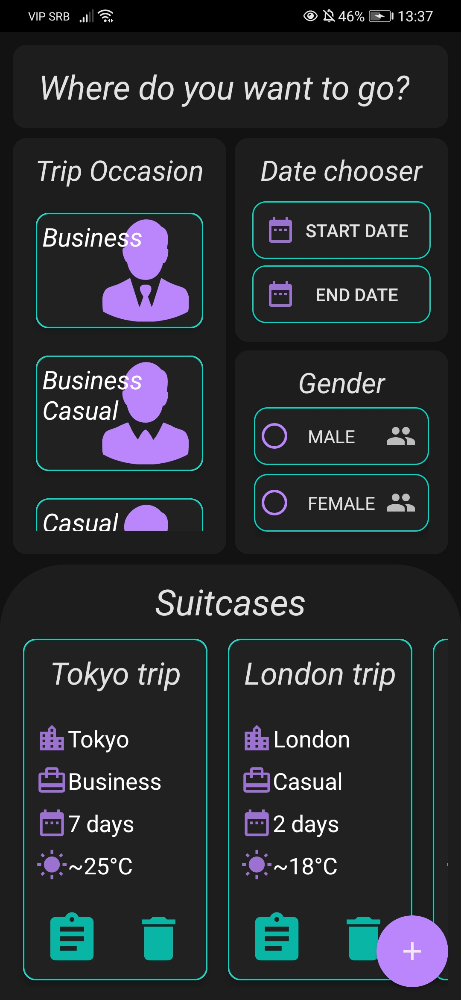
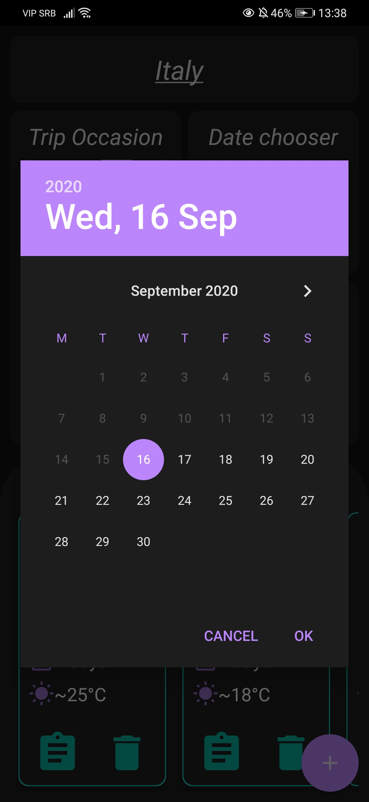
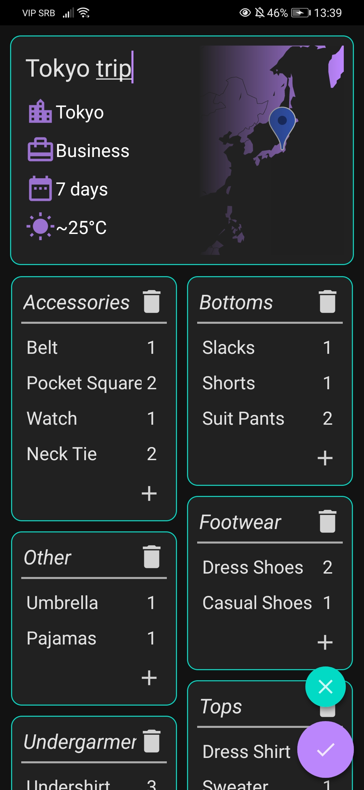
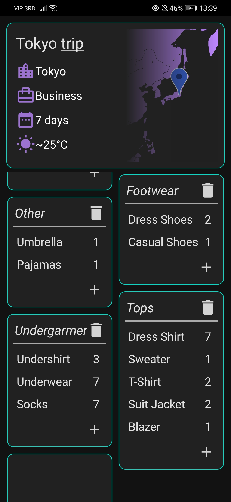
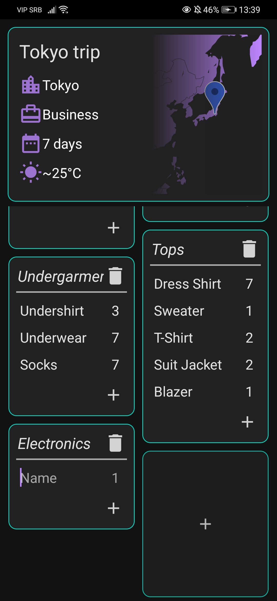

# Packing_Helper

## Overview
This is an app that makes a process of packing for your trip much easier by suggesting you some of the necessities.
Items that are recommended are picked out based on the location you are traveling to, the occasion of the trip, start and end dates and your gender.
This list of items is further improved by getting the weather forecast for all of the days you will be spending on your trip and incorporating that data in the selected items list.
We take in consideration the average temperature, the chances of rain and snow.

## Updates
The app will eventually get updates that include more precise item picking system and more options when it comes to picking your gender.
For now it's a simple packing helper and I hope anyone that uses it gets a good use out of it.

## Screenshots
    

## Non-commercial use
This app is my personal project and it does not have direct or indirect income-generating use. It will not be marketed or sold.

## Links
* [GitHub](https://github.com/jerinic-dusan)
* [Facebook](https://www.facebook.com/dusan.jerinic.7/)
* [Instagram](https://www.instagram.com/jerinic_/)
